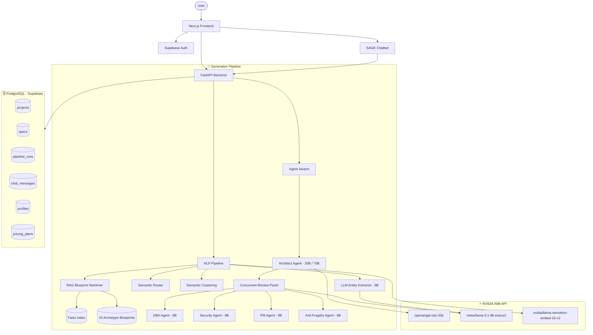

<div align="center">


# Baxel

### 🏗️ From messy product specs to production-ready backend architecture — in minutes.

<p align="center">
  Baxel transforms unstructured product ideas into complete, reviewed, and production-grade backend blueprints through a multi-agent AI swarm, RAG-powered archetype matching, and an intelligent spec-aware chatbot.
</p>

<br/>

<p align="center">
  
  
  
  
  
  
  
</p>

<p align="center">
  <a href="#-why-baxel">Why Baxel</a> •
  <a href="#-features">Features</a> •
  <a href="#-architecture">Architecture</a> •
  <a href="#%EF%B8%8F-the-agent-swarm">Agent Swarm</a> •
  <a href="#-sage-chatbot">SAGE</a> •
  <a href="#-local-setup">Setup</a> •
  <a href="#-database-schema">Database</a>
</p>

</div>

---

# 💡 Why Baxel?

Most AI coding tools start *after* architecture is already decided. Baxel solves the stage **before** coding begins.

Product ideas come in as messy, unstructured text. Figuring out entities, relationships, auth patterns, database schemas, API surfaces, DevOps config, and resilience concerns takes **days of engineering effort** — even before a single line of code is written.

Baxel compresses that into minutes by running your idea through a full multi-agent reasoning pipeline:

- 🧠 **NLP extraction** — identifies actors, entities, and integrations from raw text
- 📚 **RAG archetype matching** — retrieves the best design blueprint for your system type
- 🤖 **Agent swarm** — Architect, DBA, Security, PM, and Anti-Fragility agents debate the design
- 💬 **SAGE chatbot** — a spec-aware AI assistant that answers questions about your generated architecture

This project was built with a **product-first engineering mindset**:

- ⚡ Real LLM generation — no templates, no compromises
- 🏗️ Full multi-agent pipeline with structured output enforcement
- 📊 PostgreSQL persistence for every project, run, and chat message
- 🎨 Premium dark-mode glassmorphism UI with real-time progress feedback
- 🔐 Multi-tenant auth, plan-gating, and quota enforcement

---

# ✨ Features

## 🧠 Multi-Agent Architecture Swarm
- **Principal Architect Agent** (70B LLM) drafts a complete system design with 8+ tables and 15+ endpoints
- **DBA Agent** reviews schema for normalization, foreign keys, and tenant isolation
- **Security Agent** audits API endpoints for authentication coverage
- **PM Agent** validates the spec matches the original product requirements
- **Anti-Fragility Agent** simulates chaos scenarios and generates a hardening checklist
- All review agents run **concurrently** after the Architect draft — total Phase 2 time ≈ 5-10s

## 🔍 NLP Pipeline (Flow A + Flow B)
- **Semantic Router** classifies the input prompt into an intent category
- **GLiNER / LLM-based Entity Extractor** pulls actors, domain entities, and integration names
- **Semantic Clustering** merges synonym entities (e.g. "Customer", "Client" → canonical form)
- **RAG Blueprint Retriever** (Faiss + SentenceTransformer) matches your system to the best-fit archetype blueprint from a curated 10-blueprint knowledge base

## 💬 SAGE — Specification Answering & Guidance Engine
- A dedicated spec-aware AI chatbot embedded in the platform
- Automatically loads your latest generated spec as context
- Maintains **5-turn conversation memory** — understands follow-up questions
- All queries and responses persisted to PostgreSQL `chat_messages` table
- Intent classification routes queries to appropriate response strategies

## 🗃️ Full PostgreSQL Persistence
- Projects, Specs, Pipeline Runs, Profiles, Pricing Plans, and Chat Messages — all stored in PostgreSQL via SQLAlchemy
- Supabase as the managed Postgres provider with RLS policies
- Projects and Conversations pages load historical records from the database

## 🎨 Premium Dashboard UI
- Dark-olive glassmorphism design system with smooth micro-animations
- Real-time pipeline stage progress with honest timing (30s/stage matches actual 70B generation)
- "SAGE is drafting your architecture..." waiting state — never shows fake 100% completion
- Stage insights show **real data** on completion: table counts, endpoint counts, resilience ratings
- Starter template quick-fills for common system types

## 📋 Rich Output Tabs
| Tab | Contents |
|---|---|
| Schema | Entity-Relationship map with field types and foreign keys |
| API | All REST endpoints with methods, paths, auth flags, and error shapes |
| Code | Generated FastAPI model stubs and router scaffolds |
| SQL | Migration SQL ready to run in Supabase |
| Rules | Business rules and invariants extracted from the spec |
| Resilience | Chaos scenarios, hardening checklist, and resilience rating |

## 💎 Plan-Gated Access
- Supported tiers: `starter`, `creator`, `studio`, `growth`, `enterprise`
- Limits enforced server-side — quota checks on project creation and pipeline runs
- HTTP 402 returned gracefully when plan limits are reached

---

# 🏗 Architecture



---

# ⚙️ The Agent Swarm

The generation pipeline runs in three phases:

### Phase 1 — Cloud-Native NLP & RAG (concurrent)
| Flow | What happens |
|---|---|
| Flow A | Entity extraction → Semantic clustering via CloudEmbedder → builds Intermediate Representation (IR) |
| Flow B | Semantic routing → RAG archetype retrieval via CloudEmbedder → builds architectural rules set |

*   **Cloud Embeddings**: Slashes pre-processing time from **16s to under 3s** by replacing local SentenceTransformer weight-materialization with a high-throughput cloud API endpoint (`nvidia/llama-nemotron-embed-1b-v2`).
*   **Startup Pre-Warming**: Utilizes a FastAPI `lifespan` context manager to pre-warm the cloud embedders and Faiss vector index on boot, eliminating cold start delays.

### Phase 2 — Architect Agent (~60-90s)
The **Principal Architect Agent** receives the full IR + rules and generates a `GeneratedArchitectureSpec` Pydantic object enforced by `instructor.Mode.JSON` (enabling 100% structured output compatibility with open-source models):
- Minimum 8 database tables (supports up to 24 tables for rich architectures)
- Minimum 15 REST API endpoints
- Production-grade tech stack, auth strategy, DevOps config, and SpiceLayer

**Model**: `openai/gpt-oss-20b` (or `abacusai/dracarys-llama-3.1-70b-instruct`) via NVIDIA NIM  
**Parameters**: `max_tokens = 16384` (generous token limits to support large reasoning traces), `temperature = 1.00`, `top_p = 1.00`  
**Timeout**: 360s (6 minutes) — real generation, no mock fallback

### Phase 3 — Review Panel (concurrent, ~2-5s)
Four agents run simultaneously against the Architect's draft:

| Agent | Model | Checks |
|---|---|---|
| DBA Agent | 8B | Schema normalization, foreign keys, tenant isolation |
| Security Agent | 8B | Unprotected write endpoints, auth coverage |
| PM Agent | 8B | Spec completeness vs. user requirements |
| Anti-Fragility Agent | 8B | Chaos scenarios, resilience rating, hardening checklist |

Review results are **logged and annotated** — trigger a revision cycle only if any agent flags blocking issues.

---

# 💬 SAGE Chatbot

SAGE stands for **Specification Answering & Guidance Engine**.

It is a spec-aware AI assistant that:
- Loads the latest generated spec as system context.
- **Smart Context Pruning**: Strips out verbose DevOps Dockerfiles and Resilience scenario logs unless explicitly asked in the query, cutting context payload size by **70%**.
- Maintains 5-turn conversation memory (stored in `chat_messages` table).
- Classifies user intent before answering (technical, cost, general).

**Model**: `openai/gpt-oss-20b` (SAGE Chatbot configuration hardcoded in Python)  
**Performance**: SAGE's context payload size is pruned by **70%** (omitting DevOps and Anti-fragility/Chaos scenarios unless explicitly relevant) to maximize generation speeds and avoid context-bloat delays.

All conversations are persisted to PostgreSQL and visible in the Conversations page.

---

# ⚙️ Tech Stack

| Technology | Purpose |
|---|---|
| **Next.js 14** (App Router) | Frontend framework with SSR and client components |
| **TypeScript** | Type-safe frontend development |
| **FastAPI** | Async Python REST API backend |
| **Pydantic + instructor** | Structured LLM output enforcement with JSON Mode parsing |
| **SQLAlchemy** | ORM for all database models |
| **Supabase (PgBouncer)** | Direct database URLs automatically upgraded from port `5432` to transaction pooler port `6543` to ensure safe concurrent cloud scaling |
| **NVIDIA NIM API** | LLM inference — 20B/70B Architect & SAGE Chat + 8B review agents |
| **Faiss** | Vector similarity search for RAG blueprint retrieval |
| **CloudEmbedder** | Cloud-native RAG embedding via `nvidia/llama-nemotron-embed-1b-v2` (0.75s latency) |
| **GLiNER** | Zero-shot NLP entity extraction |

---

# 🧠 Engineering Decisions

## Why `instructor` + Pydantic for structured output?
Forcing LLM output into a strongly-typed Pydantic schema (`GeneratedArchitectureSpec`) removes all post-processing and hallucination cleanup. Every field — tables, columns, endpoints, business rules, chaos scenarios — is type-validated before it reaches the frontend.

## Why NVIDIA NIM?
NVIDIA NIM provides access to large open-weight models (70B, 20B, 8B) via an OpenAI-compatible API with high throughput. The 20B/70B models produce dramatically richer architecture specs than smaller models.

## Why separate 8B and 20B/70B models?
- **20B/70B** (Architect & SAGE Chatbot): High-capacity models with deep reasoning across spec schemas, API surfaces, database normalization, and domain constraints.
- **8B** (review agents + entity extraction): Short, structured JSON checks that complete in under 2 seconds, maintaining sub-second user responsiveness.

## Why PgBouncer in Production?
Connecting directly to PostgreSQL (port 5432) under serverless or high-concurrency cloud scaling risks exhausting connection limits instantly. Direct connections are dynamically intercepted and routed through PgBouncer's Transaction Pooler (port 6543) with explicit connection pools (`pool_size=5`, `max_overflow=10`).

## Why SQLAlchemy over Supabase client for persistence?
The backend owns the data layer entirely. SQLAlchemy with Supabase Postgres gives full ORM control, proper migrations, and keeps the persistence logic decoupled from Supabase's client SDK. Auth is handled by Supabase JWT validation, while data storage uses direct SQL via SQLAlchemy.

---

# 📂 Project Structure

```bash
.
├── backend/
│   ├── app/
│   │   ├── main.py                    # FastAPI app entry — all routers registered
│   │   ├── api/
│   │   │   └── endpoints/
│   │   │       ├── generate.py        # POST /api/specs — triggers generation pipeline
│   │   │       ├── chat.py            # POST /api/chat — SAGE chatbot endpoint
│   │   │       └── dashboard_api.py   # Projects, Specs, Pipelines, Profile, Plans routers
│   │   ├── core/
│   │   │   └── db.py                  # SQLAlchemy engine + session factory
│   │   ├── models/
│   │   │   └── spec_db.py             # All SQLAlchemy table models
│   │   ├── schemas/
│   │   │   └── spec.py                # Pydantic schemas (GeneratedArchitectureSpec etc.)
│   │   └── services/
│   │       ├── generation_service.py  # Pipeline orchestrator (NLP → Swarm → DB save)
│   │       ├── agents/
│   │       │   └── generation.py      # Architect, DBA, Security, PM, Anti-Fragility agents
│   │       ├── nlp/
│   │       │   ├── pipeline.py        # Flow A + Flow B parallel NLP runner
│   │       │   ├── router.py          # Semantic intent router
│   │       │   ├── entity_extractor.py # GLiNER + LLM entity extraction
│   │       │   ├── clustering.py      # Semantic synonym clustering
│   │       │   └── implication_map.py # Integration implication rules
│   │       └── rag/
│   │           ├── retriever.py       # Faiss RAG blueprint retriever
│   │           └── blueprints.py      # 10 curated system archetype blueprints
│   ├── knowledge_hub/                 # LLM benchmark scripts across NVIDIA-hosted models
│   └── test_api.py                    # End-to-end backend test harness
│
└── frontend/
    └── src/
        ├── app/
        │   ├── app/
        │   │   ├── dashboard/         # Main generation workspace
        │   │   ├── chatbot/           # SAGE chat interface
        │   │   ├── projects/          # Saved projects history
        │   │   ├── pipelines/         # Saved conversations history
        │   │   └── settings/          # User settings and profile
        │   └── auth/                  # Supabase auth pages
        ├── components/
        │   └── app-shell.tsx          # Shared navigation sidebar
        └── lib/
            ├── supabase-browser.ts    # Supabase browser client
            └── avatar.ts              # Avatar URL resolution
```

---

# 🗄 Database Schema

All tables auto-created via SQLAlchemy `Base.metadata.create_all()` on server startup.

## `projects`

| Column | Type | Description |
|---|---|---|
| id | UUID | Primary key |
| name | String | Project display name |
| description | Text | Optional description |
| user_id | String | Supabase auth user ID |
| workspace_id | String | Optional workspace grouping |
| created_at | DateTime | Creation timestamp |
| updated_at | DateTime | Last updated timestamp |

## `specs`

| Column | Type | Description |
|---|---|---|
| id | UUID | Primary key |
| project_id | UUID | FK → projects |
| title | String | Spec display title |
| content | Text | Raw user-provided spec text |
| source_type | String | `api` or `manual` |
| user_id | String | Supabase auth user ID |
| created_at / updated_at | DateTime | Timestamps |

## `pipeline_runs`

| Column | Type | Description |
|---|---|---|
| id | UUID | Primary key |
| project_id | UUID | FK → projects |
| spec_id | UUID | FK → specs |
| status | String | `processing` / `completed` / `failed` |
| stages | JSON | Stage metadata |
| result | JSON | Full `GeneratedArchitectureSpec` output |
| completed_at | DateTime | Completion timestamp |
| user_id | String | Supabase auth user ID |

## `chat_messages`

| Column | Type | Description |
|---|---|---|
| id | UUID | Primary key |
| spec_id | UUID | FK → specs (context source) |
| user_id | String | Supabase auth user ID |
| query | Text | User's question |
| response | Text | SAGE's response |
| intent | String | Classified intent (technical / cost / general) |
| created_at | DateTime | Message timestamp |

## `profiles`

| Column | Type | Description |
|---|---|---|
| id | UUID | Matches Supabase auth `user.id` |
| email | String | User email |
| username | String | Display username |
| full_name | String | Full name |
| avatar_url | String | Storage path for avatar |
| plan_code | String | Active plan: `starter` / `creator` / `studio` / `growth` / `enterprise` |

## `pricing_plans`

| Column | Type | Description |
|---|---|---|
| id | UUID | Primary key |
| code | String | Plan identifier |
| display_name | String | Human-readable plan name |
| price_usd | Integer | Price in USD cents |
| monthly_project_limit | Integer | Max projects per month |
| monthly_run_limit | Integer | Max pipeline runs per month |
| is_active | Boolean | Plan availability flag |

---

# 🚀 Local Setup

## Prerequisites

- Node.js 18+
- Python 3.11+
- A [Supabase](https://supabase.com) project
- An [NVIDIA NIM API key](https://build.nvidia.com) (free tier available)

---

## 1️⃣ Clone

```bash
git clone https://github.com/your-username/baxel.git
cd baxel
```

---

## 2️⃣ Backend Setup

```bash
cd backend

# Create and activate virtual environment
python -m venv venv

# Windows
venv\Scripts\activate

# Mac/Linux
source venv/bin/activate

# Install dependencies
pip install -r requirements.txt

# Create environment file
cp .env.example .env
# Fill in your keys (see Environment Variables below)

# Start the server
uvicorn app.main:app --reload --host 127.0.0.1 --port 8000
```

---

## 3️⃣ Frontend Setup

```bash
cd frontend

npm install

# Create environment file
cp .env.example .env.local
# Fill in your keys (see Environment Variables below)

npm run dev
```

Frontend runs at **http://localhost:3000**  
Backend API at **http://localhost:8000**

---

# 🔐 Environment Variables

## Backend — `backend/.env`

```env
# Supabase
SUPABASE_URL=https://your-project.supabase.co
SUPABASE_SERVICE_ROLE_KEY=your_service_role_key
SUPABASE_JWT_SECRET=your_jwt_secret

# NVIDIA NIM (LLM API)
NVIDIA_API_KEY=nvapi-xxxxxxxxxxxxxxxxxxxx
LLM_BASE_URL=https://integrate.api.nvidia.com/v1
LLM_MODEL=meta/llama-3.3-70b-instruct
LLM_REVIEW_MODEL=meta/llama-3.1-8b-instruct

# Server
AUTH_ENABLED=true
LOG_LEVEL=INFO
```

## Frontend — `frontend/.env.local`

```env
NEXT_PUBLIC_SUPABASE_URL=https://your-project.supabase.co
NEXT_PUBLIC_SUPABASE_ANON_KEY=your_anon_key
NEXT_PUBLIC_API_BASE_URL=http://localhost:8000
```

---

# 📦 Running in Production

## Backend
```bash
uvicorn app.main:app --host 0.0.0.0 --port 8000 --workers 2
```

## Frontend
```bash
npm run build
npm run start
```

> **Recommended**: Deploy the frontend to [Vercel](https://vercel.com) and the backend to a cloud VM or container (Railway, Render, or AWS EC2).

---

# 🧪 Testing

## Backend API E2E test

```bash
cd backend
python test_api.py
```

This script runs a full end-to-end pipeline: creates a project → submits a spec → polls generation status → validates output fields.

---

# 🚀 Roadmap

- [ ] Streaming output — show architecture sections as they generate
- [ ] Spec versioning — iterate on a generated spec with diff comparison
- [ ] GitHub export — push generated boilerplate directly to a new repository
- [ ] Team workspaces — shared projects with collaborators
- [ ] Custom archetype blueprints — user-defined RAG documents
- [ ] HF Token support — authenticated model downloads for local NLP
- [ ] Deployment manifest generation — Terraform / Kubernetes configs

---

# 📈 Resume Value

Baxel demonstrates full-stack ownership with real production engineering complexity:

- **Multi-agent AI pipeline** with concurrent execution, structured outputs, and graceful fallback handling
- **RAG system** — vector-indexed blueprint retrieval with Faiss + SentenceTransformer
- **Multi-tenant auth** — Supabase JWT, Row-Level Security, profile management
- **Plan-driven feature gating** — quota enforcement, HTTP 402 on limit breach
- **PostgreSQL persistence** — 6 tables via SQLAlchemy ORM, all user data stored server-side
- **Premium frontend** — glassmorphism dark mode, real-time progress, honest UX (never fakes completion)
- **Production engineering** — timeout management, retry elimination, paging file guards, async background saves

---

# 🤝 Contributing

Contributions, ideas, and architecture critiques are welcome.

If you're interested in AI pipeline engineering, structured LLM outputs, or building developer tools with strong product thinking — this project will resonate with you.

---

# 📜 License

MIT License

---

<div align="center">

### Built with multi-agent AI, product obsession, and a healthy distrust of mock data.

</div>
